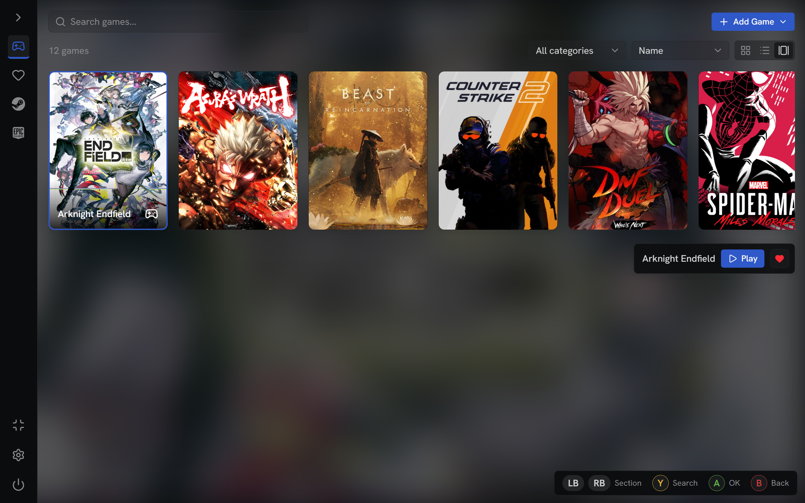
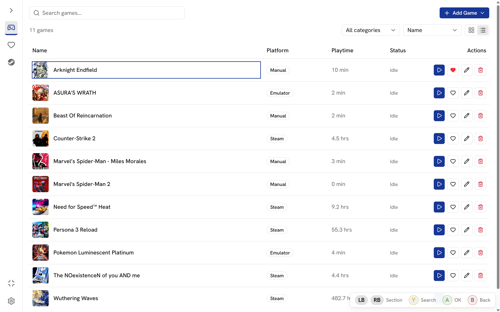
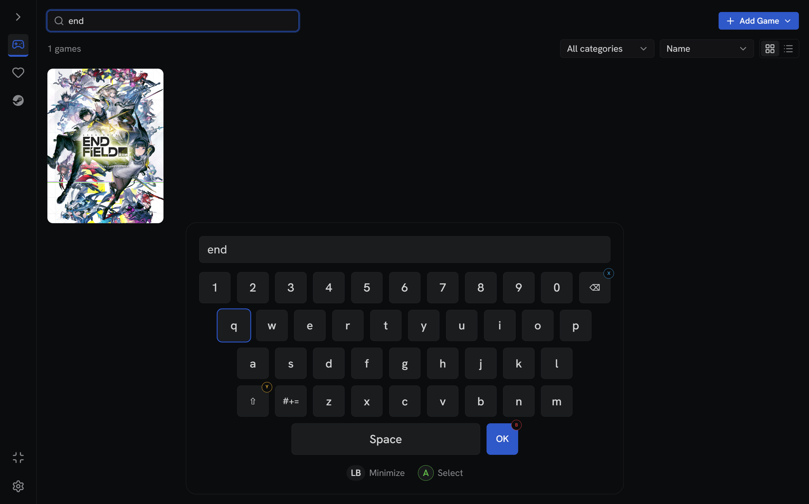
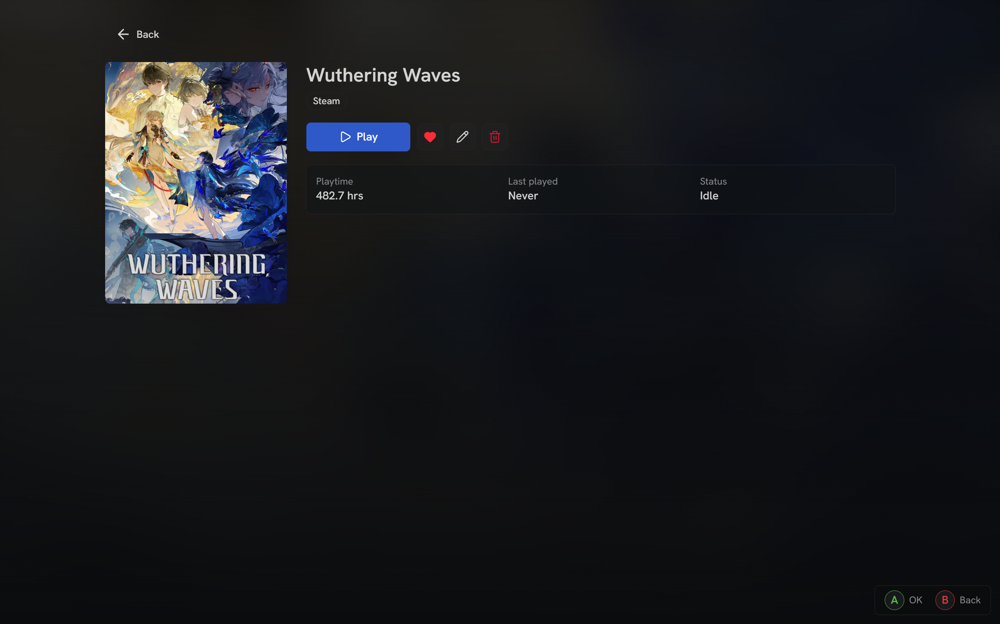
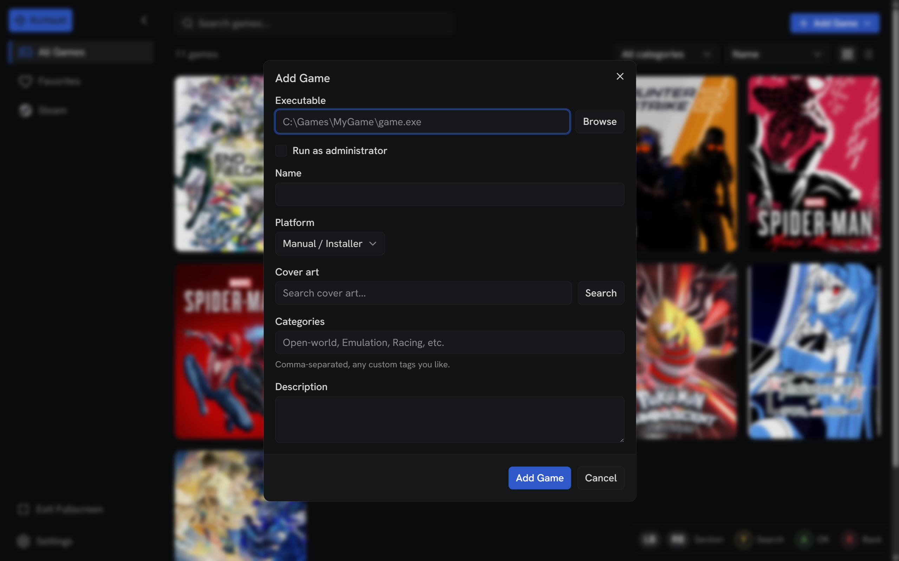
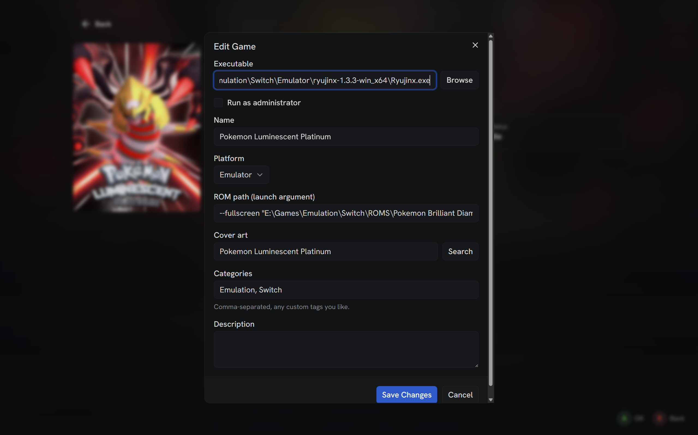

# KuVault

Desktop game library manager for Windows. Unifies Steam, Epic, and manually-added games (emulators, standalone installers) into one local library — browse, launch, and track playtime, with full gamepad navigation support.

## Screenshots








## Features

- Library grid/list view — search, sort, filter by platform/tag/favorite.
- Auto-scan installed Steam and Epic games; manual add for anything else.
- Emulator support — add a ROM/ISO as the launch argument alongside the emulator executable.
- Cover art lookup via [SteamGridDB](https://www.steamgriddb.com/).
- Launch games and track playtime locally.
- Optional Steam Web API + SteamID64 sync for real playtime import (paste a profile URL — it resolves automatically).
- Favorites, custom tags, grid/list view toggle.
- Full gamepad navigation: D-pad/stick movement, A/B/X/Y actions, virtual on-screen keyboard, LB/RB section cycling.
- Console-style Home button: jump back to KuVault while a game is running, then Continue or Stop it from the library — toggleable, on by default.
- Per-game "Run as administrator" launch option, for games that require elevation.

## Tech stack

- [Tauri v2](https://tauri.app/) (Rust backend) + [React Router v7](https://reactrouter.com/) (SPA mode) frontend.
- Tailwind CSS v4 + [shadcn/ui](https://ui.shadcn.com/) (Base UI primitives).
- SQLite via `tauri-plugin-sql` for local storage — no cloud, single machine.
- `reqwest` in Rust for SteamGridDB / Steam Web API calls.
- Bun as package manager/runner.

## Development

```bash
bun install
bun run tauri dev
```

```bash
bun run typecheck   # react-router typegen + tsc
bun run build        # react-router build
```

## Building App

```bash
bun run tauri build
```

Created by [Me](https://github.com/sofyan-rs)
